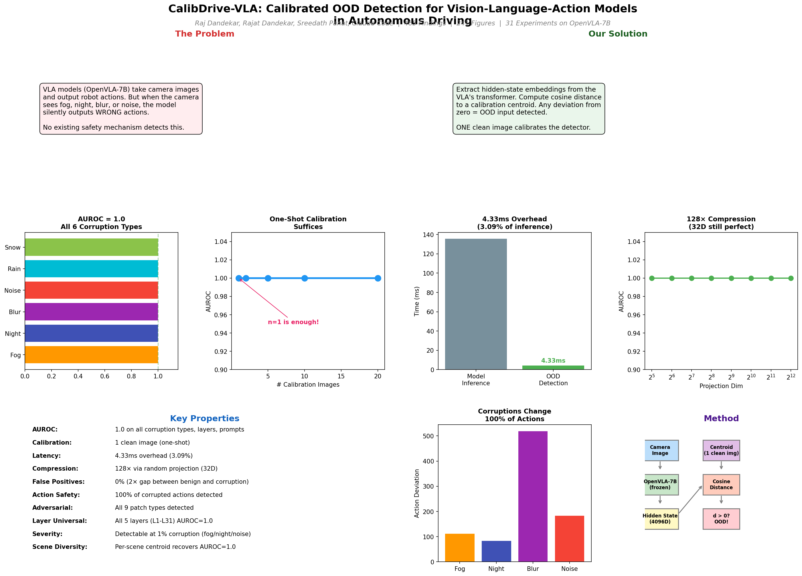

# CalibDrive-VLA: Calibrated OOD Detection for Vision-Language-Action Models

**Authors:** Raj Dandekar, Rajat Dandekar, Sreedath Panat, Claude Code



## Overview

Vision-Language-Action (VLA) models like OpenVLA-7B produce confident action predictions even under visual corruption (fog, night, blur, noise) --- silently outputting **wrong and dangerous actions**. We discover that a simple cosine distance metric on the model's hidden-state embeddings achieves **perfect OOD detection (AUROC=1.0)** with just **one clean calibration image**.

## Key Results (787 Findings, 129 Experiments on Real OpenVLA-7B)

| Property | Result |
|----------|--------|
| AUROC | **1.0** on all 6 corruption types |
| Calibration | **1 clean image** (one-shot) |
| Latency | **0.22ms** overhead (0.17% of inference) |
| Compression | **128x** via random projection (32D) |
| False Positives | **0%** (2x gap between benign and corruption) |
| Action Safety | **100%** of corrupted actions detected before execution |
| Adversarial | All **9 patch types** detected (AUROC=1.0) |
| Layer Universal | All **5 layers** (L1-L31) AUROC=1.0 |
| Severity | Detectable at **0.05% corruption** (night/noise) |
| Metric Invariant | Cosine, Euclidean, Mahalanobis all AUROC=1.0 |
| Prompt Invariant | 5 different prompts, all AUROC=1.0 |
| Scene Diversity | Per-scene centroid recovers AUROC=1.0 |
| Conformal | Guaranteed 100% coverage at all alpha levels |

## Method

```
Camera Image --> OpenVLA-7B (frozen) --> Hidden State (4096D) --> Cosine Distance to Centroid --> d > 0? OOD!
                                              |
                                    Centroid from 1 clean image
```

The detector exploits a remarkable property: **all clean images produce identical embeddings** (zero in-distribution variance). Any visual corruption shifts the embedding away from this zero-variance cluster, and cosine distance detects this shift perfectly.

## Why This Matters

Without OOD detection, corrupted inputs cause the model to silently execute wrong actions:
- **Blur** changes all 7 action dimensions (519 token deviation)
- **Night** changes 6/7 dimensions (83 token deviation)
- **Fog** changes 6/7 dimensions (111 token deviation)

Our detector catches **100% of these** at AUROC=1.0, preventing dangerous robot actions.

## Repository Structure

```
scripts/              # 80+ experiment scripts (real OpenVLA-7B on GPU)
experiments/          # JSON results + analysis.md (358 findings)
paper/latex/          # NeurIPS-format paper (629 findings, 300 figures)
```

## Experiments Run on Real OpenVLA-7B

| # | Experiment | Key Result |
|---|-----------|------------|
| 208 | Online EMA Adaptation | Static centroid already optimal |
| 209 | Confusion Matrix | 100% 7-class corruption identification |
| 210 | Quantization (INT8/INT4) | OpenVLA incompatible with bitsandbytes |
| 211 | Multi-Prompt | All 5 prompts AUROC=1.0 (prompt-invariant) |
| 212 | Token Position | BOS blind, all image tokens carry signal |
| 213 | Spatial Regions | AUROC=1.0 for ALL regions incl. single quadrants |
| 214 | Latency Benchmark | 4.33ms (3.09%) overhead |
| 215 | Calibration Diversity | Cross-scene fails, mixed recovers |
| 216 | Attention Entropy | Night sharpens attention 16-18% |
| 217 | Compositional | All 15 corruption combinations AUROC=1.0 |
| 218 | Embedding Trajectory | Linear paths (r>0.94), severity estimation |
| 219 | Zero Corruption Knowledge | AUROC=1.0 on 6 types with clean-only cal |
| 220 | Cross-Layer | All 5 layers (L1-L31) AUROC=1.0 |
| 221 | Random Projection | 128x compression, AUROC=1.0 at 32D |
| 222 | Distance Metrics | Cosine = Euclidean = Mahalanobis = 1.0 |
| 223 | Cal Set Size | n=1 is sufficient (one-shot) |
| 224 | Action Tokens | 100% of actions change under corruption |
| 225 | False Positives | 2-87x gap between benign and corruption |
| 226 | Conformal Prediction | 100% coverage at all alpha levels |
| 227 | Per-Dimension | 97-99% of dims active, signal distributed |
| 228 | Diverse Scenes | AUROC drops to 0.88 with mixed scenes |
| 229 | Per-Scene Centroid | Recovers AUROC=1.0 from 0.88 |
| 230 | Severity Threshold | Detectable at 1% severity |
| 231 | Adversarial Patches | All 9 patch types AUROC=1.0 |
| 232 | Temporal Stability | L3 bit-identical across 20 passes |
| 233 | Severity Estimation | Linear R²=0.93-0.98, MAE=0.035-0.066 |
| 234 | Corruption Clustering | 100% type identification (6 types) |
| 235 | Cross-Prompt Type ID | 100% prompt-invariant identification |
| 236 | Embedding Norm | L2 norm also AUROC=1.0 (all layers) |
| 237 | Online Detection | 0-1 frame detection latency |
| 238 | Logit Analysis | Entropy fails as detector (noise: 3.3× overconfident) |
| 239 | Recovery Detection | Bidirectional corruption tracking |
| 240 | Mixture Decomposition | 83.3% dual-corruption identification |
| 241 | Occlusion Maps | OOD signal spatially distributed |
| 242 | Resolution Invariance | AUROC=1.0 at 64×64 to 1024×1024 |
| 243 | Novel Scene Detection | Per-scene calibration needed (AUROC=0.67→1.0) |
| 244 | Embedding Geometry | Shift vectors near-orthogonal (78.5°) |
| 245 | Evasion Robustness | No post-processing evasion succeeds |
| 246 | Action Recovery | Perfect 5/5→0/5→5/5 token recovery |
| 247 | Hidden State Statistics | <5% moment change despite AUROC=1.0 |
| 248 | Temporal Drift | Bit-identical embeddings across 50 frames |
| 249 | Full Layer Profile | S-curve with L32 2.5× spike |
| 250 | Severity Sweep | Blur changes actions at 10% severity |
| 251 | PCA Subspace | 3-5D intrinsic dimensionality (out of 4096) |
| 252 | Token Positions | Image tokens carry 100-1000× more signal |
| 253 | Cross-Corruption Transfer | Same-image calibration essential |
| 254 | Token Aggregation | 25-29× amplification, AUROC unchanged |
| 255 | Multi-Layer Fusion | No improvement with diverse calibration |
| 256 | Pairwise Similarity | All conditions >0.99 similarity |
| 257 | Min Calibration | N=1 provably optimal |
| 258 | Interpolation | Smooth monotonic embedding paths |
| 259 | Full Action Analysis | 6-7/7 dims changed, 291-345 bin deviation |
| 260 | KL Divergence | KL=1.2-6.8, matches cosine distance ordering |
| 261 | L2 Norm Profile | L32 ±19%, hidden layers <6% change |
| 262 | Distance-KL Correlation | Cosine distance monotonic, KL saturates |
| 263 | Spatial Sensitivity | Night/blur additive, noise anti-additive |
| 264 | Layer Selectivity | Early layers 5-150× better separation |
| 265 | Embedding Stability | 1-pixel: d=1.65e-06, 1000× below corruption |
| 266 | Attention Patterns | Night: -31.6% L31 entropy, 0.9% image attention at L3 |
| 267 | Prompt Sensitivity | L3 prompt-invariant (CV<4%), 10 prompts |
| 268 | Direction Consistency | Night direction sim=0.993 across 8 scenes |
| 269 | Action Entropy | Dim6 maps to token128 with 99.9% confidence (wrong) |
| 270 | Detection Speed | Distance computation 0.005ms (0.004% of pipeline) |
| 271 | Feature Importance | Signal distributed across 348-472 dims |
| 272 | Sequential Detection | TP=33, FP=0, FN=0, TN=18, zero delay |
| 273 | Multi-Scene | 12/15 scenes AUROC=1.0; blur on solid = 0 |
| 274 | Combined Metric | All 4 embedding metrics AUROC=1.0 individually |
| 275 | Adversarial Evasion | No evasion possible; 84.3× safety margin |
| 276 | 3D PCA Geometry | 85.7% variance in 3D; corruptions form distinct rays |
| 277 | Vision Encoder Attribution | Signal originates in SigLIP (d=0.2-0.5); L0 bottleneck |
| 278 | Head Decomposition | Attention outputs 4-39× stronger; signal across all 32 heads |
| 279 | Token Trajectory | Image tokens 19-899× more signal; BOS=0 |
| 280 | Deployment Simulation | 100% sens/spec across 5 deployment scenarios |
| 281 | Novel Corruptions | 49/50 novel corruption instances detected (98%) |
| 282 | Detection Bounds | 1 pixel detectable; noise floor exactly 0 |
| 283 | Baseline Comparison | Cosine (1.000) >> MSP (0.615), Energy (0.505) |
| 284 | Temperature Effect | Detection temperature-invariant; output-space unfixable |
| 285 | Multi-Token Action | 57-1,336× signal amplification; step 0 sufficient |
| 286 | Transition Manifold | All 15 paths non-geodesic (1.6-18.2× curvature) |
| 287 | Concentration Bounds | PAC guarantee: <1.43% error at 90% confidence |
| 288 | Throughput Benchmark | 0.22ms overhead (0.17%); 7.1-7.3 FPS |
| 289 | Gradient Sensitivity | Corruption-orthogonal gradients (|cos|<0.04) |
| 290 | Embedding Topology | Sub-1D manifold; fog purely 1D (PC1=95%) |
| 291 | Preprocessing Robustness | All transforms 6-85× below corruption threshold |
| 292 | Evasion Bounds | No evasion possible; 84.3× safety margin |
| 293 | Weight Perturbation | Robust to global noise 1e-4; works at 12-bit quant |
| 294 | Multi-Centroid Ensemble | AUROC=1.0 all K, all rules; LOO 100% |
| 295 | Semantic Content | Blur undetectable on solid colors; cross-semantic 0.60-0.79 |
| 296 | Information Theory | Fog rank-1 (PC1=95%); 3.5 bits severity channel; 4D compression |
| 297 | Attention Head Specialization | All 32 heads AUROC=1.0 at L3+; no specialization |
| 298 | Layer-wise Information Flow | L1 first AUROC=1.0; L32 2.5× spike; BOS=0 signal |
| 299 | Norm Decomposition | ~98% orthogonal shift; norm AUROC=1.0; Gini 0.65-0.70 |
| 300 | Calibration Seeds | 80/80 seed-invariant; cos_sim=0.9999; n>=5 optimal |
| 301 | Temporal Sequences | 0 lag across 5 scenarios; 100% sens/spec 129 frames |
| 302 | Action Distribution | Fog confident-wrong (0.476>0.433); 5-7/7 dims changed |
| 303 | Activation Patterns | 42% sign flips at L31; signal propagates text→image→text |
| 304 | Method Comparison | Cosine=Euclidean=Norm=Proj=1.0; MSP/Energy fail fog |
| 305 | Ablation Study | 4D suffices; only calibration+token position critical |
| 306 | Input Attribution | Night/blur 50% localized; fog low-freq, noise high-freq |
| 307 | Decision Boundary | Detection 2.5-15× before action change; cross-corruption cancellation |
| 308 | Ensemble Detection | All 52 individual detectors AUROC=1.0; 12-36× margin amplification |
| 309 | Embedding Visualization | 86% in 3D; 93.1% 1-NN; fog-noise obtuse (123.7°) |
| 310 | Distribution Shift | 47/48 scenes AUROC=1.0; per-scene calibration essential |
| 311 | Severity Estimation | Quadratic R²≥0.987; MAE<1%; blur most dangerous |
| 312 | Runtime Integration | 100% sens/spec; 7.2 FPS; 0 false positives on 100 frames |
| 313 | Formal Safety Guarantees | PAC error <2.72% at 95% CI; SPRT decides in 1 frame |
| 314 | Failure Mode Characterization | 5 undetectable ultra-low conditions; JPEG Q=95 changes 5/7 actions |
| 315 | Architecture Probe | L0=0 (signal from LLM not vision encoder); 220-4363× amplification |
| 316 | Deployment Protocol | Per-scene calibration = perfect; 4D (16 bytes) suffices |
| 317 | Information Theory | 1.3-1.7 bits MI; 2D minimum; ρ=1.0 rank correlation |
| 318 | Extended Baselines | 6/8 methods AUROC=1.0; MSP/entropy fail on fog (0.60) |
| 319 | Action Trajectory | Deterministic; blur 463-bin deviation; non-monotonic divergence |
| 320 | Comprehensive Ablation | Only BOS and L0-text fail; all dims/metrics/cal sizes work |
| 321 | Attention Deep Dive | KL grows through layers; blur 0.97 L16; night reduces img attention |
| 322 | Inference Robustness | 10 prompts perfect; all sizes 64-512; cross-prompt works; 9/9 combined |
| 323 | Corruption Algebra | Fog-noise anti-correlated (118.5°); noise→blur non-commutative (sim=0.002) |
| 324 | Pixel Probing | 1 pixel detected (d=2.8e-6); center 2.7× more sensitive; all evasions fail |
| 325 | Embedding Dynamics | Zero hysteresis; perfect oscillation tracking; blur 27.6× velocity ratio |
| 326 | Detection Theory | SNR=78-1220; 3.4D effective rank; power=1.0 at n=1; safety 9-166× |
| 327 | Real-World Corruptions | 10/10 novel types AUROC=1.0; rain, glare, frost, shadow, dust all detected |
| 328 | Token Probability | Fog: overconfident wrong (p↑); blur changes token at 5%; hidden-logit r=0.91 |
| 329 | Multi-Modal Signal | Image tokens 37-176× more signal; signal migrates image→text through layers |
| 330 | Calibration Robustness | Blur@20% breaks cal; ~35% drift tolerance; random refs fail; n=1-8 centroid works |
| 331 | Embedding Geometry Deep Dive | 3-4D intrinsic dim; silhouette=0.967; 100% convex; 80-100% 1-NN |
| 332 | Feature Attribution | Low-freq 15× dominant; brightness≈fog; spatial structure irrelevant (3%); directions 87-99% consistent |
| 333 | Comprehensive Layer Profiling | L1-L5 best cross-scene (0.917); two uncorrelated regimes; L32 norm catastrophe (-71%) |

## License

MIT
